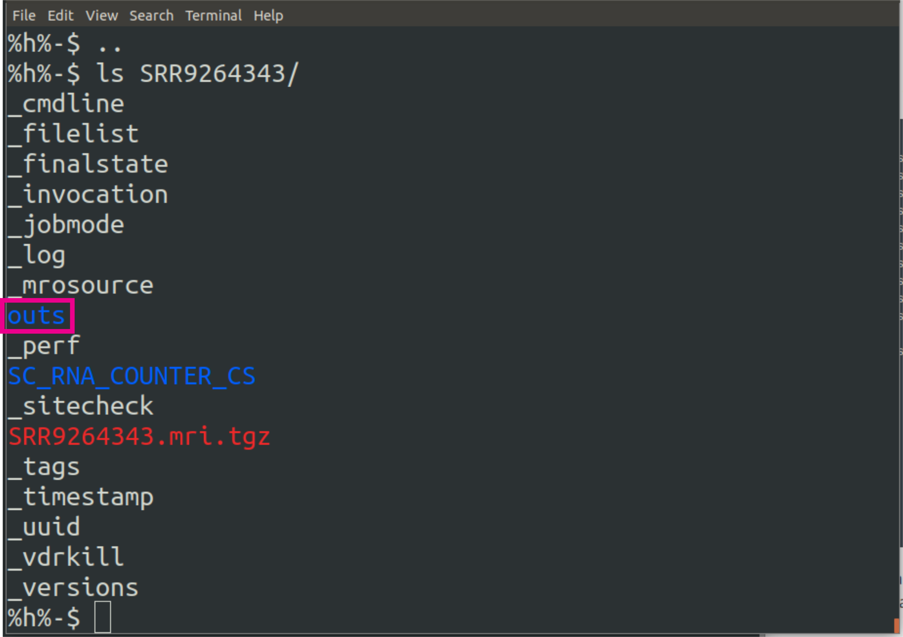
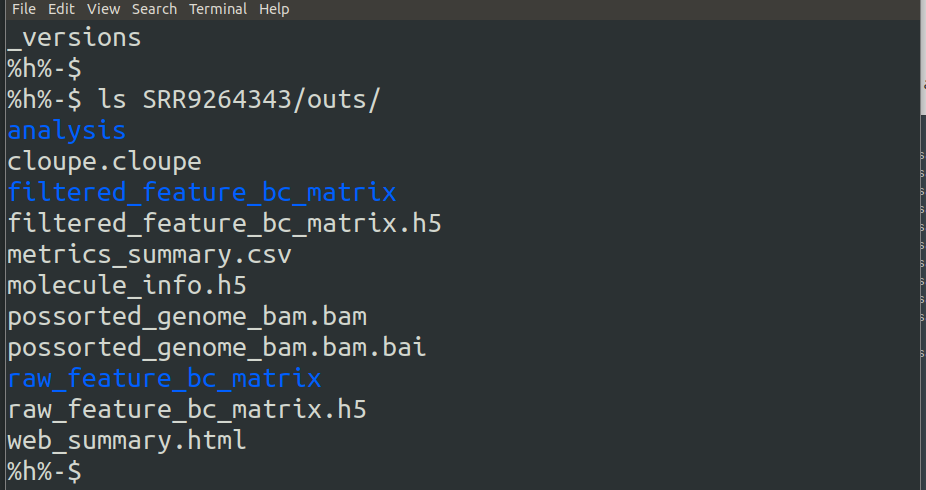
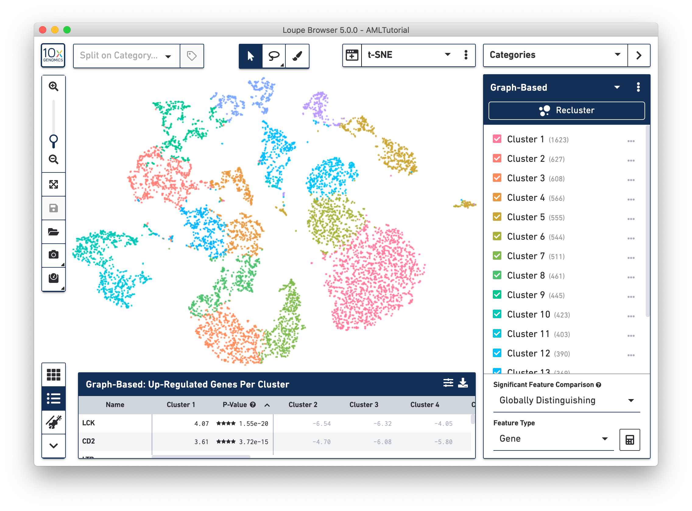
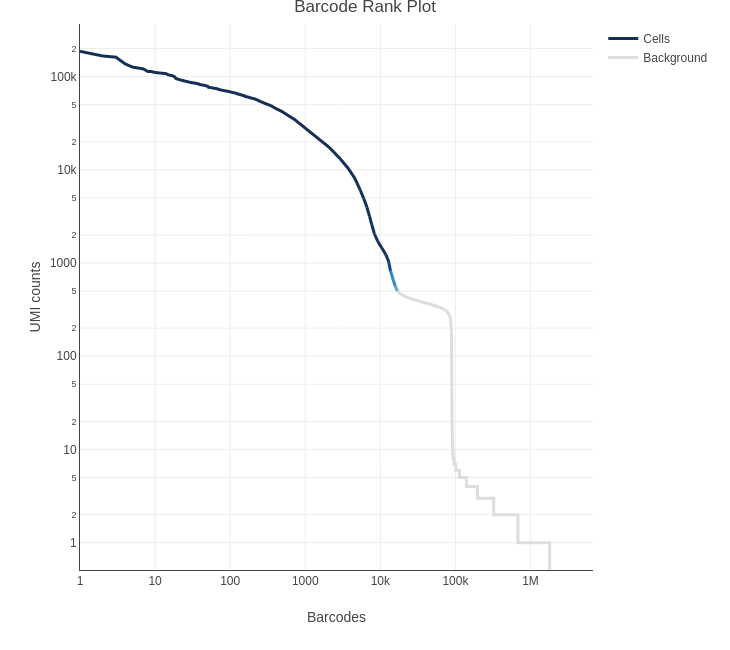

```{r setup, include = FALSE}
```

# Introduction

The first step in the analysis of single cell RNAseq data is to align the
sequenced reads against a genomic reference and then use a transcriptome
annotation to generate read counts for each feature of interest. Typically
for scRNAseq the features of interest are genes.

There are a variety of tools for doing this and your choice will depend in part
on the method by which the library was generated. For data generated using the
10x-Chromium method data the most common approach is to use the 
[Cell Ranger](https://support.10xgenomics.com/single-cell-gene-expression/software/pipelines/latest/what-is-cell-ranger)
tool provided by 10x. This not only carries out the alignment and feature
counting, but will also:

* Call cells, i.e. filter the raw matrix to remove droplets that do not contain
  cells   
* Generate a very useful report in html format, which will provide some QC
  metrics and an initial look at the data   
* Generate a "cloupe" file, which can be opened using the [10x Loupe
  Browser](https://support.10xgenomics.com/single-cell-gene-expression/software/visualization/latest/what-is-loupe-cell-browser)
  software to further explore the data.  
  
Cell Ranger is computationally very intensive, you will not be able to run it on
a laptop or standard desktop computer. You will need access to the
high performance computing (HPC) cluster. 

Alternative methods include:

* **[STAR solo](https://github.com/alexdobin/STAR/blob/master/docs/STARsolo.md)** -
  this tool is built into the general purpose STAR aligner (Cell Ranger actually
  uses STAR under the hood). This will generate outputs very similar to
  Cell Ranger minus the cloupe file and the QC report. The advantage over
  Cell Ranger is that it is much less computationally intensive and will run
  with lower memory requirements in a shorter time.
* **[Alevin](https://salmon.readthedocs.io/en/latest/alevin.html)** - This tool
  is based on the popular Salmon tool for bulk RNAseq feature counting. Alevin
  supports both 10x-Chromium and Drop-seq derived data.

For the purposes of this course, seeing as we are working with 10x-Chromium
derived data, we will use Cell Ranger. As detailed instructions are available
on the [Cell Ranger pages](https://support.10xgenomics.com/single-cell-gene-expression/software/pipelines/latest/what-is-cell-ranger) of the 10x website, this chapter will not be
comprehensive in terms of all options, but should provide a brief overview.

Cell Ranger incorporates a number of tools for handling different components of
the single cell RNAseq analysis. In this chapter we will be looking at the
`count` tool, which is used to align reads, quantify gene expression and call
cells. Later in the course you will encounter the `aggr` (aggregate) tool, which
can be used to merge multiple samples into a single experiment-level data set.

In addition to the analysis tools, Cell Ranger also includes the `mkref` tool to
generate a custom Cell Ranger reference from genomic and transcriptomic
references.

For this week's practical we will learn how to create a custom reference for 
Cell Ranger and how to use Cell Ranger's `count` tool to align single cell
RNAseq reads, quantify gene expression per a droplet and identify which droplets
potentialy contain cells.

# Installing Cell Ranger

## Installing Cell Ranger

[Download Cell Ranger](https://www.10xgenomics.com/support/software/cell-ranger/downloads#reference-downloads) from 10xgenomics website.

Cell Ranger runs on Linux, and full installation instructions can be found on the
[10x website](https://support.10xgenomics.com/single-cell-gene-expression/software/pipelines/latest/using/tutorial_in).


**/mnt/scratcha/bioinformatics/chilam01/Bitesize_SingleCell_2024/software/cellranger-7.2.0**

We will use this version during this practical.

# Cell Ranger reference data

## Common references from 10X

Cell Ranger, like other aligners, requires the information about
the genome and transcriptome of interest to be provided in a specific format.
If you are working with the standard genome/transcriptome of human or mouse
then you can download prebuilt references from the [10x
website](https://support.10xgenomics.com/single-cell-gene-expression/software/downloads/latest)
(there is even a combined human-mouse genome reference, which is useful for
patient-derived xenograft experiments).

The Bioinformatics Core maintains a repository of references from 10X here:

**/mnt/scratcha/bioinformatics/reference_data/10x**

Note that this includes references for single cell ATAC sequencing and 
references for ATAC+Gene Expression libraries (ARC).

In addition, it should be noted that the references supplied by 10X have not 
been updated for some time and they are outdated with reference to the current
Ensembl release.

## Custom references

If you require a reference for the genome of another species, wish to use the
most recent releases or wish to add custom transcripts to the gene annotation
(e.g. fusion genes), then you will need to build your own index using the Cell
Ranger `mkref` tool.
In order to prepare our reference for Cell Ranger, we need two files: 

- A reference genome in FASTA format
- A transcript annotation file in GTF format 

These files can be downloaded from public repositories such as 
[Ensembl](https://www.ensembl.org) 
(see [EnsemblGenomes](https://ensemblgenomes.org/) 
for non-vertebrate genomes). As an example for our course, we have downloaded
one of the chromosomes from the
[human genome page](https://www.ensembl.org/Homo_sapiens/Info/Index).
In a real-life scenario you would download the full genome, conventionally named
`<species>.<version>.dna.toplevel.fa.gz` (for example,
`Homo_sapiens.GRCh38.dna.toplevel.fa.gz`). We have also downloaded the GTF file
with transcript annotation for our genome from the same site.

# Sync the required data to your scratch drive

We have placed all the data you require on cluster. You will first need to 
create a copy of this on your scratch drive. Note that you will need to do this
at the start of each practical session, so we will use the `rsync` command. This
command synchronises two directories, it will not copy files that are already 
present in the destination directory unless they differ from the copies in the
source directory.

First log in to the cluster if you have not already done so:

```{bash, eval=FALSE}
ssh clust1-headnode
```

You will need to enter your password. 

Next navigate from the home directory to your "scratch A" (or "scratch B" if you
prefer). You will need to replace the `<GROUP>` and `<USERNAME>` with your
personal details:

```{bash, eval=FALSE}
cd /scratcha/<GROUP>/<USERNAME>
```

For example if you were part of the Winton group with the username
"smith01", then the command would be:

```{bash, eval=FALSE}
cd /scratcha/dwlab/smith01
```

**Note**: if you do not already have a directory under `/scratcha/<GROUP>` you will
need to create one using `mkdir`.

Now copy the **Course_Material** directory from the bioinformatics scratch:

```{bash, eval=FALSE}
rsync -vrptg /scratcha/bioinformatics/Course_Materials .
```

The rsync options we've used do the following:  

* `v` - verbose: prints out each file it copies  
* `r` - recurse into directories  
* `p` - preserve permissions  
* `t` - preserve time stamps  
* `g` - preserve the group  

The last three options are required so that when we run the rsync command 
again, files that have already been copied will look exactly the same as the
originals and so will not be copied again.

Now navigate into the **Course_Materials** directory. All practical work will be
carried out in this location.

```{bash, eval=FALSE}
cd Course_Materials
```

# A note regarding the execution of jobs on a cluster

  * `Do NOT run jobs on head node (login node)`.
  * In general, once you have logged into the cluster, you will land on the head node. Next, you execute commands or scripts using the job manager, CI cluster uses a job manager called [slurm](https://slurm.schedmd.com/documentation.html)
  * Interested in learning more about Slurm Job Manager? The university offers a one-day course on the topic. [HPC course materials](https://cambiotraining.github.io/hpc-intro/materials/03-slurm.html)

  * For this course IT has crated a separate reservation called `chilam01_101` to play and learn.
  * It will be active from 4 March to 19 April 2024.
  * For all computing activities in this course, you must use this reservation.
  * We already included `--reservation=chilam01_101` in the scripts, therefore running the scripts by default uses chilam01_101 reservation.


# Creating a custom reference for Cell Ranger

We will create a new Cell Ranger reference in which we will include three custom 
genes - these could for example be transgenes or fusion genes. For the sake of 
time we will only include chr14 from the human genome, but in reality you would
normally use the full human reference genome. The "custom genes" we are going to
be adding are in fact just random sequences generated for the purposes of this
practical.

To make a custom reference we will use the Cell Ranger `mkref` command. You can
find detailed instructions on how to use it to create a reference on the [10X 
website](https://support.10xgenomics.com/single-cell-gene-expression/software/pipelines/latest/advanced/references).

The first step is to create a fasta file for the custom gene sequences and an
accompanying gtf file with the gene annotations. We have already done this for
you. 

In the basic genome reference fasta there is one sequence for each chromosome or
contig. The gtf contains details of the genomic locations of different features,
such as genes, exons, transcripts and CDSs, on each of these sequences along
with "attributes" for each of these features such as gene names, gene IDs etc.
Each gene will have multiple entries, e.g one for each exon detailing is start
and end locations on the chromosome.

You can read more about the format of the gtf file
[here](http://www.ensembl.org/info/website/upload/gff.html). For the Cell Ranger
reference the critical tags in the "attributes" column of the gtf are the
"gene_id", "gene_name" and "transcript_id".

The sequences for the custom genes are the full transcript sequence. In the
fasta file we create one chromosome/contig for each gene. For the gtf we will
therefore define the gene as having one exon starting at position 1 and ending
on the last base of the contig.

You should see a directory called **references**, which currently contains four
files:

* customgenes.fa
* customgenes.gtf
* Homo_sapiens.GRCh38.105.chr14.gtf
* Homo_sapiens.GRCh38.dna.chromosome.14.fa

The first two files are the references for our "custom genes", the second two
are the references for human chromosome 14. You can view the contents of these
files with `cat`, or `head` to just the look at the top few lines.

You should also see a directory call **scripts**. This contains the 
scripts we will use to the make the reference and then do the alignment, 
counting and cell calling. It also contains a script called *masterscript.md*, 
which contains all the commands that we will type at the command line in this
practical.

## Combine the custom gene references with the human references

The first step is to combine the two sets of references.

```{bash, eval=FALSE}
cd references
cat Homo_sapiens.GRCh38.105.chr14.gtf customgenes.gtf > combined.gtf
cat Homo_sapiens.GRCh38.dna.chromosome.14.fa customgenes.fa > combined.fa
cd ..
```

You should now have two new files in the **references** directory called
*combined.gtf* and *combined.fa*.

## Run `mkref` on the combined reference

Now we run the `cellrange mkref` tool on the combined reference. This will 
require significant memory and multiple cpus, so we will submit this as a batch
job to the cluster. In the scripts directory you can find the
*CellRanger_MakeRef.sh* file which is the shell script we will submit. You can
view the contents with `cat`.
 
To submit the job to the cluster scheduler, we use the Slurm command `sbatch`:

```{bash, eval=FALSE}
sbatch scripts/CellRanger_MakeRef.sh
```

You can check the Slurm queue to see if the job is running or pending using:

```{bash, eval=FALSE}
squeue -u <username>
```

You'll need to replace `<username>` with your username. The output will look 
something like:

```
             JOBID PARTITION     NAME     USER ST       TIME  NODES NODELIST(REASON)
          17681304   general CR_mkref  smith01 PD       0:00      1 (None)
```
The "PD" indicates that the job is "Pending". Once the job is running this will
change to "R" and the "TIME" will indicate how long the job has been running.
for. 

:::box 
<details><summary>Detailed explanation of code in *CellRanger_MakeRef.sh*</summary>
```
#!/bin/bash
```
This first line determines which interpreter will be used to run the rest of the
script. There are many kinds of interpreter - bash, tsch, Perl, R Python. For general
unix command line script we will us `bash`.

```
#SBATCH --cpus-per-task=8
#SBATCH --mem=32G
#SBATCH --time=2:00:00
#SBATCH --reservation=chilam01_101
#SBATCH -o cellranger_mkref.%j.out
#SBATCH -e cellranger_mkref.%j.err
#SBATCH -J cellranger_mkref
```
These  lines are instructions to the the Slurm scheduler, which manages the
allocation of cluster resources to jobs that have been submitted. The first
three lines are essential and are stating that this job will require 8
processors, 32 Gigabytes of memory and up to 2 hours to run. The `-e` and `-o`
lines are giving names for files to which output messages or errors from the 
script will be written; the `%j` will be replaced by the job number that is
allocated when the job is run. This way if you run the script multiple times,
you can identify which instance each file refers to.

```
export PATH=/mnt/scratcha/bioinformatics/chilam01/Bitesize_SingleCell_2024/software/cellranger-7.2.0/bin:${PATH}
```

This line modifies the "PATH" global variable to add the directory containing the
`cellranger` software. The "PATH" is a variable that contains the *paths* of
directories containing various tools we might want to use at the command line.
When you type a command at the command line or in a script, the shell searches
these directories to find the a file matching that command. 

```
cellranger mkref --genome=GRCh38_custom_10X \ 
                 --fasta=references/combined.fa \
                 --genes=references/combined.gtf \
                 --memgb=32 \
                 --nthreads=8
```
* `--genome`  - here we specify a name for the output folder that will contain
the reference  
* `--fasta` - this the path to the fasta file we wish to use to create the new
reference   
* `--genes` - this the path to the gtf file we wish to use to create the new
reference  
* `--memgb` - This specifies the memory that cellranger should use  
* `--nthreads` - this specifies the number of threads that cellrange can split 
the job into; it should match the `min-cpus` option in the header of the script.  
</details>
:::

The output of the script is a directory **GRCh38_custom_10X** (you can use any
name you wish). This directory contains the various files that make up the Cell
Ranger reference. We could then use this in the next step where we will align
the reads, count reads against genes and identify which droplets potentially
contain cells.

# Running Cell Ranger `count` on single cell RNAseq data

Full details for running the `cellranger count` tool can be found on the 
[10x website](https://support.10xgenomics.com/single-cell-gene-expression/software/pipelines/latest/using/count).
Here, we go through a typical analysis workflow with this tool. We are not going
to use the reference we generated above, but rather a full human genome
reference as provided by 10X.

We will download data for this exercise from the Genomics server in exactly the
same way you would do if you have had your own samples sequenced by the Genomics
Core. The one piece of information we will need is the "SLX" ID. In this case,
we will be using some data generated by Kasia as part of testing library prep
reagents. There are **five** samples in the sequencing run. The SLX ID is 
**SLX-21334**.

## Download clarity tools

We will be using a piece of software developed specifically for the CI called
"Clarity Tools" to retrieve the data from the servers. We will first need to
download the clarity tools file.

```{bash, eval=FALSE}
mkdir software
wget -P software http://internal-bioinformatics.cruk.cam.ac.uk/software/clarity-tools.jar 
```

This will download the *clarity-tools.jar* file into a directory called 
**software**.

## Download data

Now that we have clarity tools we can use the *Fetch_sequence_data.sh* script to
download the data.

```{bash, eval=FALSE}
sbatch scripts/Fetch_sequence_data.sh SLX-21334
```

This script is different to the *CellRanger_MakeRef.sh* script, in that we have
not "hard coded" the SLX ID into the script, but rather need to include it in
the command calling the script. This means we can reuse the script with any
sequencing project.

This will create a directory called **SLX-21334**, which contains all the
outputs from the automated sequencing processing. 

There are five files for each sample, the sample is identified by the name of
the sample barcode added during library prep:


* **SLX-21334.{SampleBarcode}.HTLCWDRXY.s_2.i_1.fq.gz** - Index 1 (Sample index)  
* **SLX-21334.{SampleBarcode}.HTLCWDRXY.s_2.i_2.fq.gz** - Index 2 (Sample index)  
* **SLX-21334.{SampleBarcode}.HTLCWDRXY.s_2.md5sums.txt** - checksum file - see note below  
* **SLX-21334.{SampleBarcode}.HTLCWDRXY.s_2.r_1.fq.gz** - Read 1 (10x Droplet Barcode + UMI)  
* **SLX-21334.{SampleBarcode}.HTLCWDRXY.s_2.r_2.fq.gz** - Read 2 (RNA fragment sequence)  


Note: checksums are a way to ensure the integrity of downloaded data. See 
(here for more details)[https://ukdataservice.ac.uk/learning-hub/research-data-management/store-your-data/checksums/].

There are also five "lost reads" files:

* **SLX-21334.HTLCWDRXY.s_2.i_1.lostreads.fq.gz** - Index 1 lost reads
* **SLX-21334.HTLCWDRXY.s_2.i_2.lostreads.fq.gz** - Index 1 lost reads
* **SLX-21334.HTLCWDRXY.s_2.lostreads.md5sums.txt** - checksum for lost reads
* **SLX-21334.HTLCWDRXY.s_2.r_1.lostreads.fq.gz** - Index 1 lost reads
* **SLX-21334.HTLCWDRXY.s_2.r_2.lostreads.fq.gz** - Index 1 lost reads

When the data come off the sequencer, all the reads for all the samples are in a
single file. In order to separate them, the automated process compares the reads
in index files (i_1 and i_2) to the list of indexes assigned to each sample
(from the Genomic LIMS) and assigns reads to the appropriate sample fastq. Due
to technical issues, e.g. sequencing errors, there will always be a small number
of reads with indexes that do not match any expected indexes. These reads are
placed in the "lostreads" files.

The **SLX-21334.HTLCWDRXY.s_2.html** file is QC file containing basic information
about the sequencing quality. You should move this file to your local machine 
and check that everything looks okay.

The remaining files relate to the automated processing of the raw sequencing
data (in bcl2 format) to the fastq format:

* **SLX-21334.HTLCWDRXY.s_2.bcl2fastq.zip** - Zip file stats related to automated processing
* **SLX-21334.HTLCWDRXY.s_2.contents.csv** - Details of the samples from the genomics LIMS


## Rename the fastq to the correct format for Cell Ranger

To run Cell Ranger `count`, the fastq files for samples to be processed should be
placed in a single directory. Cell Ranger will be run separately on each sample.
You will need to provide the software with the sample name (e.g. SITTH10) of the
sample to be processed. Cell Ranger expects the file names of the fastq files to
follow a specific convention so that it can correctly identify the files for the
each sample. The convention is the default convention used by `bcl2fastq`
(the tool that converts the raw sequencing data in `bcl` format into `fastq`
files):

```
<SampleName>_S<SampleNumber>_L00<Lane>_<Read>_001.fastq.gz
```

* **\<SampleName\>** - An identifier for the sample, this is what Cell Ranger
  uses to determine which fastq files to combine into a single sample.
* **\<SampleNumber\>** - This is the sample number based on the order that
  samples were listed in the sample sheet used when running `bcl2fastq`. This
  is not important for Cell Ranger, other than it indicates the end of the
  Sample Name, you can set all your samples to S1.
* **\<Lane\>** - The lane number. If your sequencing was run across multiple
  lanes, then you may have multiple sets of fastqs for a single sample with
  different lane numbers.
* **\<Read\>** - The read type: **R1** for Read 1, **R2** for Read 2, and index
  reads are **I1** and **I2**.
* **001**  - The last segment is always 001.

You will see that the files we have downloaded from the Genomics server do not
follow this convention. Rather than renaming the files, it is better to create
a new fastq directory with "soft links" (like shortcuts on a Windows or Mac) 
that are named according to the Cell Ranger convention and point to the 
corresponding fastq file. In the **scripts** directory there is a
script called *SoftlinkFastq.sh* that will do this for us. This is only a small
job, so there is no need to submit to the cluster, we can just run this on the 
headnode.

```{bash, eval=FALSE}
./scripts/SoftlinkFastq.sh SLX-21334
```

If you use the command `ls -ltr` on the new **fastq** directory, you will see 
that it contains links with names in the Cell Ranger naming convention that
point to the files in the **SLX-21334** directory.

## Retrieve a copy of the reference

It is a good idea to keep a copy of the reference used alongside your analysis.
This may help if you need to come back to it in the future. You could download
the reference directly from the [10X
website](https://support.10xgenomics.com/single-cell-gene-expression/software/downloads/latest).
We will copy the reference from the Bioinformatics Core's reference directory.

```{bash, eval=FALSE}
cp -r /mnt/scratcha/bioinformatics/reference_data/10x/refdata-gex-GRCh38-2020-A \
  references/.
```

## Running `cellranger count`

The minimum information require to run `cellranger count` is:

* **\-\-id** - A sample ID. This is used for naming the outputs   
* **\-\-transcriptome** - the directory containing the Cell Ranger reference   
* **\-\-fastqs** - the directory containing the fastq files

This will process all fastq files in the `--fastqs` directory into a single
sample. If you have multiple samples in a single directory then you need to
add:

* **\-\-sample** - the SampleName from the fastq files as above.

Starting with Cell Ranger 6.1, it is generally recommended to specify the 
estimated number of cells (defaults to 3,000):

* **\-\-expect\-cells** - estimate of the expected number of cells in the 
library. 

In addition, Cell Ranger is very computationally intensive, you will usually
be wanting to run it on a high performance cluster or server, and it is 
advisable to set limits to the resources it will use:

* **\-\-localcores** - the number of processors Cell Ranger should use   
* **\-\-localmem** - the amount of memory, in Gigabytes, Cell Ranger should use.

We will use the script `CellRanger_Count.sh` to run the Cell Ranger pipeline on
each sample. This scripts requires two inputs - the sample name or barcode ID
for the sample to be processed and the path to the Cell Range reference
directory. You may optionally also provide the expected number of cells - this
will default to 3000 if it is not provided. The estimated number of cells for 
these samples is 3000-4000, so we'll stick with the default.

```{bash, eval=FALSE}
referenceDir=references/refdata-gex-GRCh38-2020-A
for barcode in `ls --color=never fastq/ | cut -f 1 -d '_' | uniq`; do
  sbatch scripts/CellRanger_Count.sh ${barcode} ${referenceDir}
done
```

# Cell Ranger outputs

Cell Ranger will create a single results folder for each sample names. Each
folder will be named according to the `--id` option in the command. In the top
level of the directory is a sub-directory called `outs`, this contains the
results of the analysis pipeline. There are also many intermediate and log
files/directories that will not be of immediate interest.

The contents of the sample directory will look like this:

```{r outputDir, fig.align='center', out.width="50%", echo=FALSE}

```

The contents of the `outs` directory are:

```{r outputDirOuts, fig.align='center', out.width="50%", echo=FALSE}

```

* **analysis** - The results of clustering and differential expression analysis
  on the clusters. These are used in the *web_summary.html* report.
* **cloupe.cloupe** - a cloupe file for loading into the 10x loupe browser
* **filtered_feature_bc_matrix** - The filtered count matrix directory 
* **filtered_feature_bc_matrix.h5** - The filtered count matrix as an HDF5 file
* **metrics_summary.csv** - summary metrics from the analysis  
* **molecule_info.h5** - per-molecule read information as an HDF5 file 
* **possorted_genome_bam.bam** - The aligned reads in bam format 
* **possorted_genome_bam.bam.bai** - The bam index 
* **raw_feature_bc_matrix** - The raw count matrix directory 
* **raw_feature_bc_matrix.h5** - The raw count matrix as an HDF5 file 
* **web_summary.html** - The summary report 

The two count matrix directories each contain 3 files:

* **barcodes.tsv.gz** - The cell barcodes detected; these correspond to the
  columns of the count matrix
* **features.tsv.gz** - The features detected. In this cases gene ids. These
  correspond to the rows of the count matrix.
* **matrix.mtx.gz** - the count of unique UMIs for each gene in each cell.

The count matrix directories and their corresponding HDF5 files contain the same
information, they are just alternative formats for use depending on the tools 
that are used for analysis. In this course we will be loading the contents of 
the count matrix directories into R.

The filtered count matrix only contains droplets that have been called as cells
by Cell Ranger.  

## The summary report

The Cell Ranger summary report - `web_summary.html` - is a very useful first 
port of call for assessing the quality of the data. An example is linked
[here](web_summary.html) (See also [here](https://content.cruk.cam.ac.uk/bioinformatics/CourseData/UnivCamScRnaSeqNov2021)).

The first tab, **Summary**, contains various QC metrics about sequencing quality, mapping
quality and cell calling. The second tab, **Analysis**, provides some basic
analysis of droplets that Cell Ranger has identified as potentially containing
cells, including some clustering and gene expression analysis. This report
is interactive, allowing you to some very basic data exploration.

The report itself contains brief explanations of the contents of each section.
These can be accessed by clicking the question mark icon in the header of the
section. A more comprehensive explanation of the various components of the 
report can be found on [the 10x website](https://support.10xgenomics.com/single-cell-gene-expression/software/pipelines/latest/output/summary).

## The cloupe file and the Loupe browser

The `cloupe.cloupe` file that Cell Ranger generates can be loaded using the 
[Loupe Browser application](https://support.10xgenomics.com/single-cell-gene-expression/software/visualization/latest/what-is-loupe-cell-browser) provided by 10x. This provides an interactive
visualization and analysis platform that allows you to extensively explore your
data with a point and click interface. The 10X website provides extensive 
instructions on how you can use the Loupe Browser.

```{r LoupeBrowser, fig.align='center', out.width="75%", echo=FALSE}

```

The browser will allow you, for example, to find cells of interest through
filtering and clustering tools, identify genes whose expression characterizes
particular clusters of cells, or identify the type of cells in different
clusters based on gene expression. While the browser is an excellent tool for
data exploration and identification of potential avenues of analysis, it should 
not be used as a substitute for proper bioinformatic analysis. In particular,
it should be remembered that Cell Ranger has not performed any QC on the 
contents of the droplets it has called as cells - in the next section of the
course we will perform additional QC to eliminate poor quality cells.

## The count matrices

### What are the counts?

Remember that for each read we have a sample barcode, a cell barcode, and a
UMI.  In addition we now have location on the genome and a corresponding gene
annotation.  The count for any gene for any cell is the number of unique reads
detected for the combination:

sample barcode + cell barcode + UMI + gene ID

Thus we avoid counting PCR duplicate reads as these will have the same UMI. For
this reason we more commonly talk about the "UMI count" rather than the "Read
count"; the "Read count" could be higher than the "UMI count"

### The count matrix outputs

The raw count matrix outputs can be found in the directory 
`outs/raw_feature_bc_matrix` under each sample directory. This contains three
files:

* *barcodes.tsv.gz* - containing a list of cell (droplet) barcodes detected
* *features.tsv.gz* - containing a list of all the features (genes) assayed
* *matrix.mtx.gz* - containing the counts for each gene for each barcode

The *matrix.mtx.gz* is not a simple table of **barcodes** x **features**. Most
of these counts would be '0' and given the very large numbers of barcodes and
features, the full table would be extremely large. In order make things more 
manageable the *matrix.mtx.gz* file only contains information about *cells* in
the table that are non-zero.

Use the following commands to look at the three files and understand how they 
are related:

```{bash, eval=FALSE}
zcat SITTA11/outs/barcodes.tsv.gz | head
zcat SITTA11/outs/barcodes.tsv.gz | wc -l
zcat SITTA11/outs/features.tsv.gz | head
zcat SITTA11/outs/features.tsv.gz | wc -l
zcat SITTA11/outs/matrix.mtx.gz | head
zcat SITTA11/outs/matrix.mtx.gz | wc -l
```

`head` just prints out the top 10 lines of the file; `wc -l` gives you the 
number of lines in the file.

### Filtered vs. Raw matrices

Cell Ranger performs some analysis on the data to distinguish between droplets
that contain cells and empty droplets. The filtered counts matrices only contain
data for droplets that Cell Ranger has determined to contain cells. It performs
this filtering in two steps.

1. UMI threshold based filtering:  
  By default, Cell Ranger expects 3000 cells (you can change this in
  the arguments of the Cell Ranger command). Cell Ranger takes the top 3000
  droplets by UMI counts. It then takes the UMI count at the 99th percentile of
  this set of cells. It then divides this number of UMIs by 10 to determine a
  hard UMI threshold. All droplets with a UMI count above this threshold are
  called as cells.

2. Comparison of droplet RNA profile with background:  
  This algorithm is based on one initially developed in the `dropletUtils` R
  package. Cell Ranger selects all droplets with a UMI count of less than 500
  (this will usually be 100's of thousands). This set of droplets is assumed to
  definitely not contain cells and as such any RNA detected is merely background
  within the media (due to damaged cells leaking RNA). An RNA profile is derived
  for this background. The RNA profile of all droplets with more than 500 UMIs
  but less than the hard UMI threshold is then compared to this background
  profile. Any droplet with a profile that differs significantly from the
  background profile is called as a cell.

A detailed description of the Cell Calling algorithm, along with explanations
of the other algorithms used in the alignment and countings steps, can be found
on [the 10x Cell Ranger pages](https://support.10xgenomics.com/single-cell-gene-expression/software/pipelines/latest/algorithms/overview)

The plot below shows a "barcode rank plot". This is taken from the Cell Ranger
`web_summary.html` report.

{width=50%}

This plot shows the UMI counts for all droplets, the droplets have been ranked
by UMI count and coloured according to whether they have been called as cells or
not. The light blue region, indicates a region where some droplets have been 
called as cells, but other have not - depending on the outcome of the RNA 
profiling step of the algorithm.

### Cell Ranger reports

Each sample has a report created by cell ranger that provides QC and cell 
calling information, along with some preliminary clustering and differential
expression analysis. The report can be found at `outs/web_summary.html` under
the directory for each sample.

On your laptop open the `web_summary.html` reports for each of the samples and
review the results.
