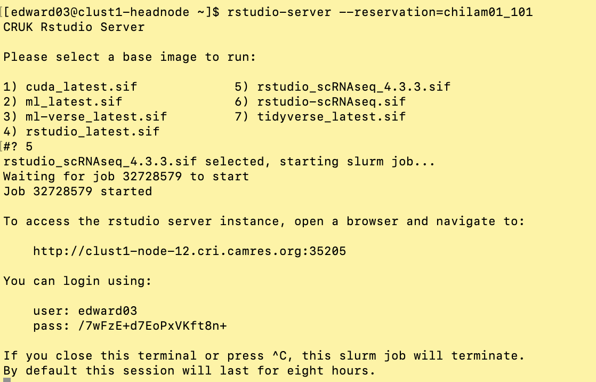

# How to access the R-Studio Server

## Start the server

To start the RStudio server use the following command:
  

__**scripts/rstudio-server.sh**__

This will send a job to the cluster to start the RStudio server with 8 cores and
32 Gigabytes of memory. Once the job starts you will get a message like this:
  

To launch the RStudio server:
  
* leave this job running in the terminal window (if you stop it, the session
                                                   will end)
* copy the URL provided into your browser
* Enter your username and password. The username is your normal username.
The password is given in the message above. **Note:** The password will change
each time you start a new session.  
* Remember to terminate the cluster job when you are finished with session 
(just press `Ctrl + c` in the terminal window).  

The RStudio server may not start with the working directory set to your 
`Course_Materials` directory, so you may need to change this (once you've done
this once, it *should* remember for later sessions.)

