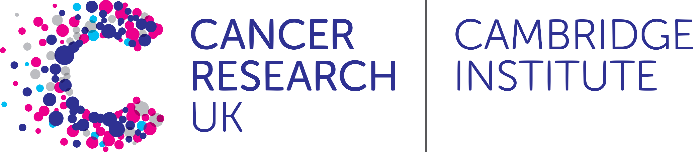

# Introduction to single-cell RNA-seq data analysis - Bitesize
### 7 week course
#### Bioinformatics Core Facility, Cancer Research UK Cambridge Institute

## Instructors

* Abbi Edwards - Bioinformatics Core, Cancer Research UK Cambridge Institute
* Ashley Sawle - Bioinformatics Core, Cancer Research UK Cambridge Institute
* Chandra Chilamakuri - Bioinformatics Core, Cancer Research UK Cambridge Institute
* Jason Skelton - Genomics Core, Cancer Research UK Cambridge Institute
* Kamal Kishore - Bioinformatics Core, Cancer Research UK Cambridge Institute
* Matthew Eldridge - Bioinformatics Core, Cancer Research UK Cambridge Institute

## Outline

This workshop is aimed at biologists interested in learning how to perform
basic single-cell RNA-seq analyses. 

This will focus on the droplet-based assay by 10X genomics and include running
the accompanying `cellranger` pipeline to align reads to a genome reference and
count the number of read per gene, reading the count data into R, quality control,
normalisation, data set integration, clustering and identification of cluster
marker genes, as well as differential expression and abundance analyses.
You will also learn how to generate common plots for analysis and visualisation
of gene expression data, such as TSNE, UMAP and violin plots.

(Materials linked to below will be updated closer to the time of delivery)

> ## Prerequisites
>
> __**Some basic experience of using a UNIX/LINUX command line is assumed**__
> 
> __**Some R knowledge is assumed and essential. Without it, you
> will struggle on this course.**__ 
> If you are not familiar with the R statistical programming language we
> strongly encourage you to work through an introductory R course before
> attempting these materials.
> We recommend our [Introduction to R course](https://bioinformatics-core-shared-training.github.io/r-intro/)
> You will also need a CI cluster account and be familiar with its use.

## Data

* The course data is based on '[CaronBourque2020](https://www.nature.com/articles/s41598-020-64929-x)'
  relating to pediatric leukemia, with four sample types, including:
  * pediatric Bone Marrow Mononuclear Cells (PBMMCs)
  * three tumour types: ETV6-RUNX1, HHD, PRE-T  
* The data used in the course can be [downloaded from Dropbox](https://www.dropbox.com/sh/qwxgat50tsg8m3r/AAAzQd5WXuEBGOFl3m4f5B1La?dl=1) (the file is 4.2GB compressed and XXGB when uncompressed, so make sure you have enough space on your computer). Please note that:
  * these data have been processed for teaching purposes and are therefore not suitable for research use;

## How will it work?

Each week there will be a taught Tuesday session (1:00-3:30 pm) in the room 009 and a Friday clinic online session (2-3pm). Calendar invites for these meetings (on teams) should have been sent to your CRUK email address. 

It is assumed you will try the exercises between the two sessions. At the clinic the speaker will go through the exercises and answer any questions. During the week you can also ask questions at anytime to your designated member of the bioinformatics core. You should have had an email identifying who this but if you are unsure please contact `analysisteam-bioinformatics@cruk.cam.ac.uk`.
  

## Schedule

### Week 1

* Introduction to Single Cell Methods - Abbi Edwards
  + [Slides](Slides/IntroSingleCellTech-Bitesize.pdf)
* Preamble: data set and workflow - Chandra Chilamakuri
  + [Slides](Slides/02_PreambleSlides.html)
* Alignment and cell counting with Cellranger - Chandra Chilamakuri
  + [Slides](Slides/03_CellRangerSlides.html) \([pdf](Slides/03_CellRangerSlides.pdf)\)
  + [Practical](Markdowns/03_CellRanger.html)

### Week 2 

* Quality Control and Filtering - Abbi Edwards 

  + [RStudio Server Instructions](Server.md)

  + [Practical](Markdowns/04_Preprocessing_And_QC.html)

  + [Exercise](Markdowns/04_Preprocessing_And_QC.Exercise.html) 

  

### Week 3 

* Normalisation - Kamal Kishore

  + [Slides](Slides/05_NormalisationSlides.html)
  + [Practical](Markdowns/05_Normalisation.html)
  + [Exercises](Markdowns/05_Normalisation_exercises.html)

### Week 4

* Feature selection and Dimensionality Reduction - Chandra Chilamakuri
  + [Slides](Slides/06_FeatureSelectionAndDimensionalityReduction_slides.html)
  + [Practical/Exercises](Markdowns/06_FeatureSelectionAndDimensionalityReduction.html)

### Week 5

* Batch Correction and Data Set Integration - Kamal Kishore
  + [Slides](Slides/07_DataIntegrationAndBatchCorrectionSlides.html)
  + [Practical/Exercise](Markdowns/07_Dataset_Integration.html)
  + [Recording](https://crukci-my.sharepoint.com/:v:/g/personal/kamal_kishore_cruk_cam_ac_uk/EXlMYN6w5uVOpzHjCLV_Zu0BIFFYXah2XgdmZEcFkZdgxg?e=Pwb8WP&nav=eyJyZWZlcnJhbEluZm8iOnsicmVmZXJyYWxBcHAiOiJTdHJlYW1XZWJBcHAiLCJyZWZlcnJhbFZpZXciOiJTaGFyZURpYWxvZy1MaW5rIiwicmVmZXJyYWxBcHBQbGF0Zm9ybSI6IldlYiIsInJlZmVycmFsTW9kZSI6InZpZXcifX0%3D)
    
<!--
### Week 6

* Clustering and Cluster Marker genes - Ashley Sawle  
  + [Slides](Slides/08_09_Clustering_and_Marker_Genes.html)  
  + [Clustering Materials](Markdowns/08_Clustering_Materials.nb.html)  
  + [Cluster Marker Gene Selection Materials](Markdowns/09_ClusterMarkerGenes.nb.html)  
  + [Recording](https://crukci-my.sharepoint.com/:v:/g/personal/ashley_sawle_cruk_cam_ac_uk/EbOuS-MxoEFHp7-0bZoulgEBfsFT9kJDzVKx4Etnotrwxw?e=MnvBp9)

  + [Clustering and Marker Gene Selection Exercise](Markdowns/08_09_Clustering_and_Marker_Genes_Exercise.html)  
  + [ClusterSweep batch script solution](scripts/ClusterSweep.Solution.R)  
  + [Clustering and Marker Gene Selection possible solution](Markdowns/08_Clustering_Exercise.Solutions.html)  
  + [Recording](https://crukci-my.sharepoint.com/:v:/g/personal/ashley_sawle_cruk_cam_ac_uk/EWqzcQR9fydCtuqOdhrfFjQBiBk6-7Dm5XT6XpNLmFRrPA?e=oUkwca)

### Week 7

* Differential Expression and Abundance - Abbi Edwards
  + [Slides](Slides/10_MultiSplCompSlides.html)
  + [Demo](Markdowns/10_MultiSplComp.html)
  + [Recording](https://crukci-my.sharepoint.com/:v:/g/personal/ashley_sawle_cruk_cam_ac_uk/EZqnSAU9l-pLuJREdqAVGFcBirwfR2rvTcauB4VrbNMpOg?e=dNlOCK)
  + [Bulk RNASeq Analysis Course materials](https://bioinformatics-core-shared-training.github.io/Bulk_RNAseq_Course_Apr22/)
  + [Recording of clinic](https://crukci-my.sharepoint.com/:v:/g/personal/ashley_sawle_cruk_cam_ac_uk/EbQNBtxgUP9AvBAGUC8WSrQBB67vNcuxJtTyAt9sGoPfWA?e=65hLg4)
  
  
  
-->
## Additional Resources

* [Bioconductor for relevant R packages](https://bioconductor.org/)
* [RStudio CheatSheets](https://rstudio.com/resources/cheatsheets/)

## Acknowledgements

This course was initialy based on the [OSCA](https://bioconductor.org/books/release/OSCA/) (Orchestrating Single-Cell Analysis) book with subsequent modifications by

Abigail Edwards

Ashley Sawle

Chandra Chilamakuri

Kamal Kishore

Stephane Ballereau

Hugo Tavares

Katarzyna Kania

  - The original paper is here: https://dx.doi.org/10.1038/s41592-019-0654-x

